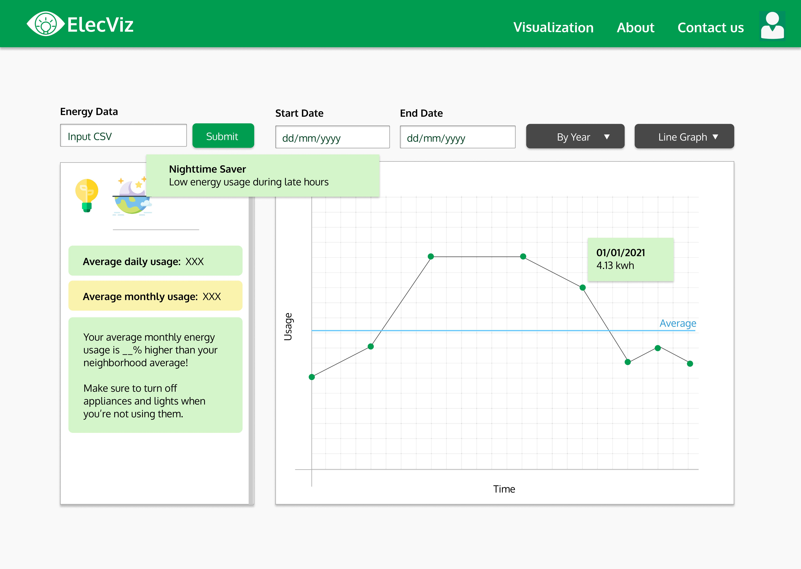
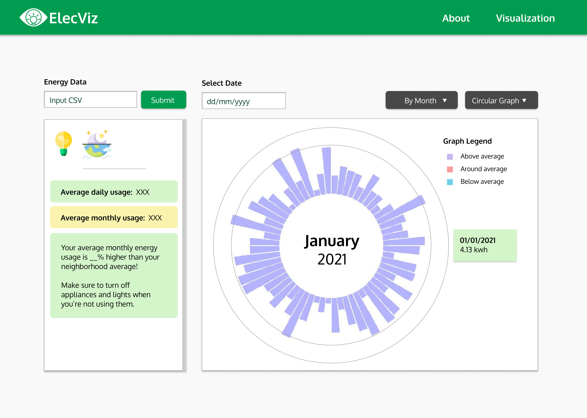
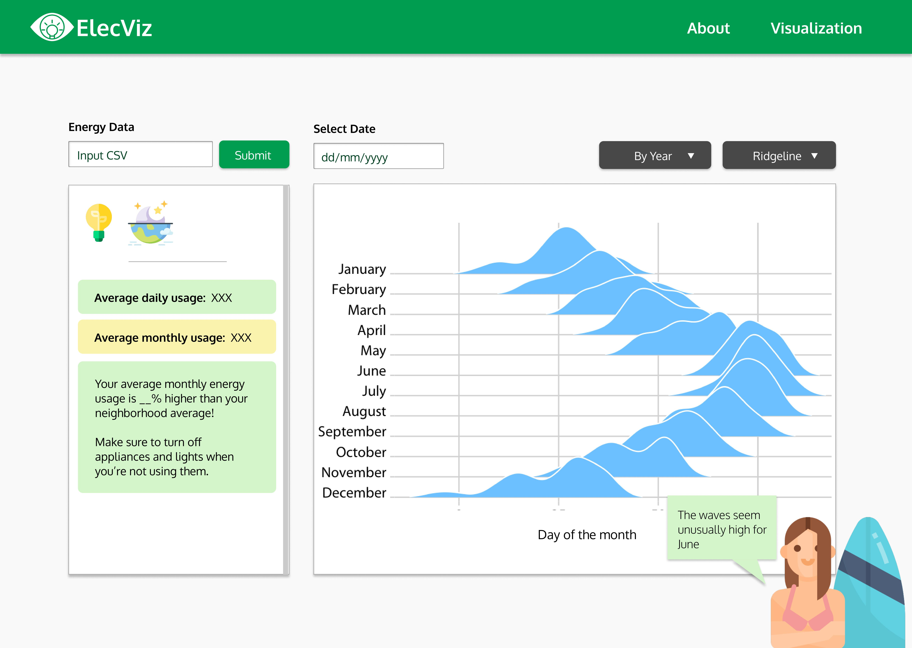

#  ElecVis

Project by: Atyaf Alnafeesah, Bonnie Skiena, David Boulden, Jeremy Redrup, Vincent Beardsley, Zihan Wu

## Overview

The goal of the ElecVis project is to promote more engagement with energy usage information. This project aims to provide easy-to-understand energy visualization and helpful tips for users to manage their energy usage.

## Setup Environment for VSCode

- Install Live Server from vscode extensions.
- Right click in an html file and press 'Open with Live Server'.
- This shows live changes to the markup, css, and javascript.
- To deploy to github-pages, enable github-pages in the settings of the repo and simply push changes to the specified branch.

## Tools Used

Currently we are using the D3 library [https://d3js.org/] along with javascript to generate graphs. 
The Bootstrap library [https://getbootstrap.com/] was used for the nav bar and general form styling.

For front-end design we used Figma [https://www.figma.com/], a free online editor to create mockups. 
For icons, free images were used from [https://www.flaticon.com/], but we also considered using [https://fontawesome.com/] to insert icons directly into text.

## Implemented Features

### Energy Visualization

Currently for all energy visualizations, the user submits a CSV file which gets parsed and converted into the format dataset we want based on the date range and time interval selected by the user (this is heavily detailed in the script.js file). Using D3, we then create a scalable vector graphic (svg) and call one of our makeGraph functions based on what type of visualization the user wants. We made sure to keep the visualization page, graphs, and overall website entirely scalable for mobile.

Right now, the website can only accept data in the format of the CSV files in the energyData folder. We would like to be able to scrape other formats of energy datasets for information in the future. Information regarding baseload energy usage is displayed and we are working on ways to display average energy usage.

#### Existing Issues

- Tick marks for the x-axis of the bar graph are aligned left instead of centered.
- Bar graph x-scaling needs fixing.
- Radial plot axis still indicators need to be implemented.
- No checks in place for when the time interval selection is greater than the dataset time range.
- Considering limiting the time granularity options for the user, especially uncommon ones like 15 min and 12 hr ones.

### Tips

Tips to save energy are displayed to the left of the graph. These are a work in progress. The script contains an addTip function that can display any text as a styled tip. Tips should be automatically generated upon energy data submission and would give suggestions on how to save energy. 

Something akin to: *"Your energy average energy usage was __% above average for this period of time, try utilizing natural light and turning off appliances when not in use."*

We are also looking into the idea of having a dataset representing neighborhood energy usage, and using this dataset to generate tips comparing neighborhood averages to individual household energy usage.

### Navigation

The overall site navbar can be edited in navbar.html file. Our script ensures it can be inserted like a module to any page using **< div id='navbar'>< /div >** , so it needn't be edited on every page.

The contacts page is currently just a form skeleton and theoretically could be hooked up to some kind of backend or request management system in the future.

## Initial Design Mockups

## Additional Considerations for the Future

- Interactive display of data points upon hover-over (D3 has tools in place for this).
- Badges awarded to gamify keeping track of energy usage.
- Icons, graphics, or colors changing based on how well or poorly the user is managing their energy usage.
- Additional visualization options for data.
